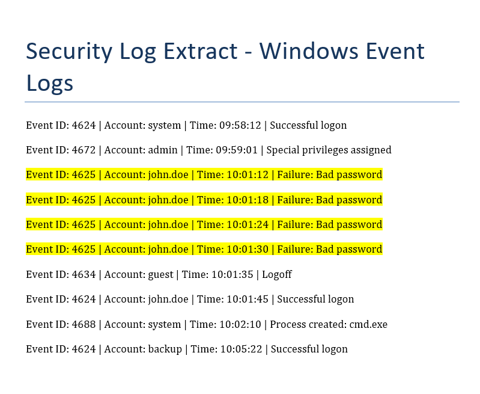

# soc-log-analysis-bruteforce
SOC log analysis project detecting brute-force login attempts using simulated Windows Event Logs
# SOC Log Analysis – Brute Force Detection

## Overview
This project demonstrates basic SOC analyst skills by identifying potential brute-force login attempts using Windows Security Event Logs.

## Tools Used
- Windows Event Viewer  
- Windows Security Logs  

## Scenario
A sequence of failed login attempts was identified targeting a single user account, followed by a successful login.

## Method
- Analysed Event ID 4625 (failed logins)  
- Identified repeated authentication failures within a short timeframe  
- Checked for successful login (Event ID 4624) after failures  
- Reviewed timestamps and login patterns  

## Findings
Multiple failed login attempts were observed targeting the same account within seconds.

This behaviour is consistent with brute-force login attempts.

A successful login shortly after the failed attempts suggests potential account compromise.

## Recommendations
- Implement account lockout policies  
- Enable multi-factor authentication (MFA)  
- Monitor authentication logs for repeated failures  

## Screenshot

### Failed Login Pattern

This screenshot shows multiple failed login attempts (Event ID 4625) targeting the same user account within a short timeframe.
